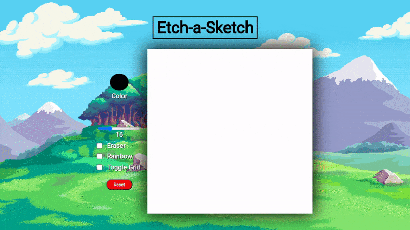
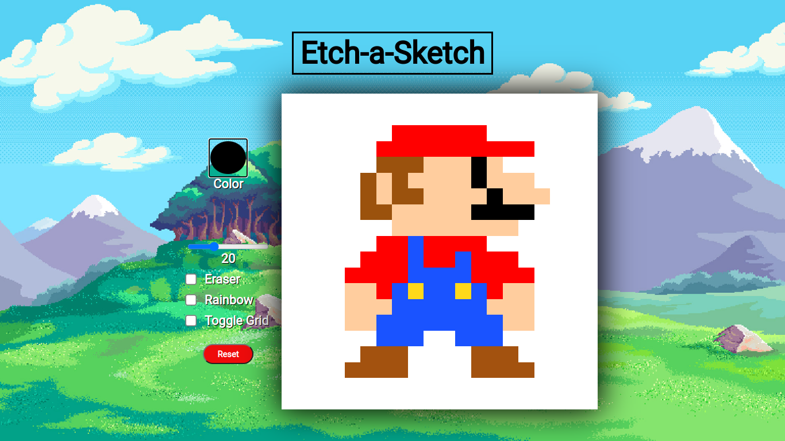
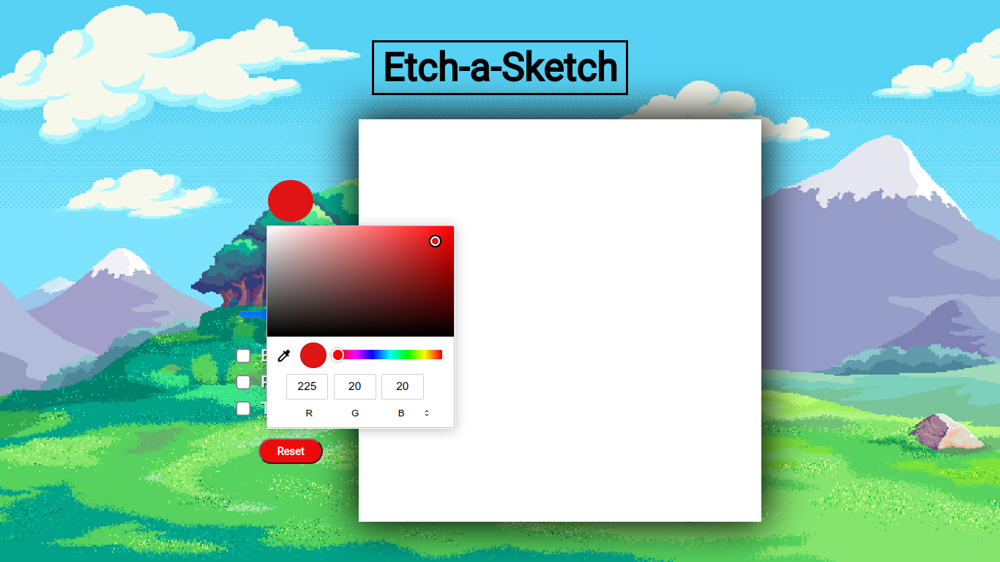
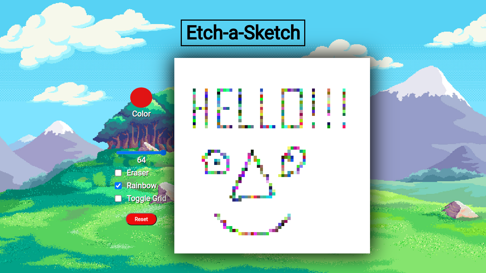

<h1 align="center">Etch-A-Sketch</h1>
<h3 align="center"><a href="https://gaaabbb.github.io/etch-a-sketch/">:film_projector: Live Demo</a></h3>

## :scroll: Description
This project, which was created as part of TheOdinProject's Foundations Course, is a web version of something between a sketchpad and an Etch-A-Sketch where the assignment is to practice my skills in DOM manipulation and utilizing event listeners. This project allows users to freely draw on a canvas, adjust its pixel size, and change the brush color.

## :pencil2: Features
* A fully functional Etch-A-Sketch or sketchpad.
* Allows user to pick their desired color using a color picker.
* A rainbow brush that randomly choses a color whenever the user draws.
* An eraser tool to erase drawing.
* A reset button that erases the whole drawing.
* Able to toggle grid.
* Change the pixel size of canvas.

## :framed_picture: Gallery
#### Custom Art

#### Toggle Grid

#### Change Color

#### Rainbow Brush

## :computer: Languages Used
* HTML
* CSS
* JavaScript

## :copyright: Credits
### Background Image
* [Fez Escalante](https://www.behance.net/FezEscalante)
### Note
*I don't own any of the the pictures and fonts used in this website. The rights for the materials I used belong to the respective authors and artists.*